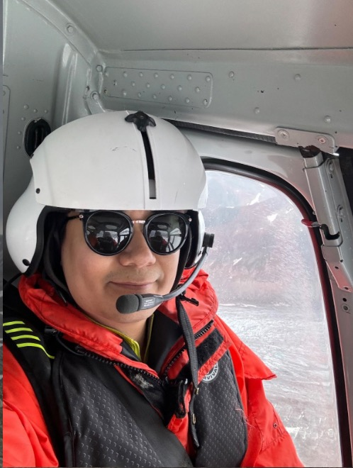

::: {.columns .profile-cols}
::: {.column width="30%"}
{.profile-photo}
:::

::: {.column width="70%"}
## Kyungmin Kim

**Ph.D. Candidate**  
Alaska Volcano Observatory
Geophysical Institute  
Department of Geosciences  
University of Alaska Fairbanks  

📧 [kkim39@alaska.edu](mailto:kkim39@alaska.edu)
:::
:::

## About Me

I am a geophysicist interested in interpreting Earth systems through seismic signals, with a primary focus on volcanic environments. My research seeks to understand what volcanic seismicity reveals about the physical evolution of volcanic systems, the mechanisms that generate these signals, and how such processes can be reproduced through laboratory experiments and physics-based modeling.

I am also interested in whether seismic observations can help infer subsurface structures that cannot be directly measured. Beyond volcanoes, I study seismic signals from other environments, including glaciers and landslides.